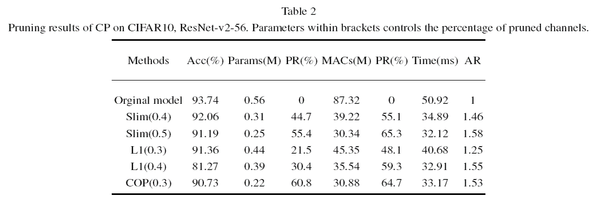

## Multi-granularity-Pruning-for-Deep-Residual-Networks
This code is a re-implementation of the imagenet classification experiments in the paper Multi-granularity-Pruning-for-Deep-Residual-Networks(JIFS2020).

### Implemetation
This code is implemented by Pytorch1.2.

### Run
modify config.py
Block prune:
python main.py
python block_prune_v2.py(ResNetv2) --prune
python finetune.py
Channel prune:
python channel_prune.py
python finetune2.py

### Results on Cifar10

### Author 
Yangke Huang, email: yangke_huang@163.com
